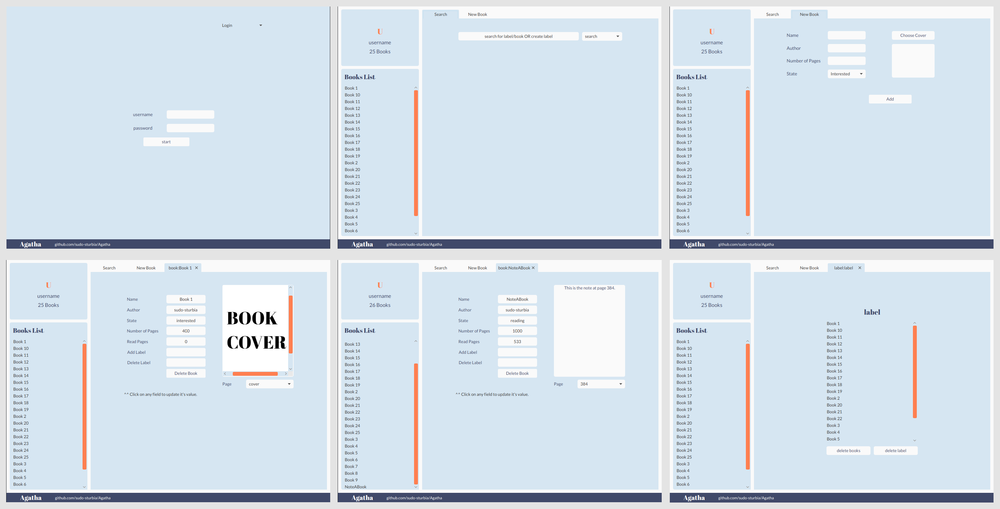

# Agatha
> TCP/IP client/server personal library manager.



Agatha enables users to

- Add/remove books to/from their library,
- Add notes to books' pages (one note per page), and update them freely,
- Arrange books into collections using labels,
- Search through library using names of books or labels, and
- Update book-related information such as number of read pages, book's
state (interested, currently reading, or read), and more.

## How to Install?
### Prerequisites
To use Agatha you need **JDK 11** or higher, and **MySQL** for Agatha's
server.

For ubuntu/debian

```shell
apt install default-jdk default-jre mysql-server
```

### Installation
You can download a compiled JAR for both Agatha's client and server. JARs
are available through the releases tab.

To compile source code:

1. Clone the repositery.
```shell
git clone https://github.com/sudo-sturbia/Agatha.git
```

2. Use the provided Gradle wrapper.
```shell
./gradlew build
```

### Testing
First you need to update information in server's `TestUtil.setup`. Info includes
MySQL server credentials, and the name of the database used for testing.
**Make sure** to use a unique name as testing database is deleted after tests
are finished.

After that you can simply run
```shell
./gradlew test
```

## How to Use?
### Agatha's Server
To run the server  use one of the following
```shell
./gradlew :server:run            # If you're using gradle
```
```shell
java -jar agatha-server-1.0.jar  # If you're using the JAR
```

The server takes the following options
```shell
    -p  --port <number>              Port number to listen to, default: 54321
    -d  --database <name>            Name of database to user, default: Agatha
    -su --db-server-username <name>  Username for database server (MySQL), default: root
    -sp --db-server-password <pass>  Password for database server (MySQL), default: ""
```

Communication with the server can be done without need for the gui
client, a session can be started using netcat.

Agatha uses a custom communication protocol. Documentation for the
protocol is available in `com.github.sudo_sturbia.agatha.server.Protocol.java`.

### Agatha's Client
To run the client use one of the following
```shell
./gradlew :client:run <host> <port>            # If you're using gradle
```
```shell
java -jar agatha-client-1.0.jar <host> <port>  # If you're using the JAR
```
For the client to work the server must be running.
